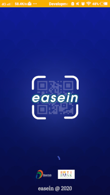
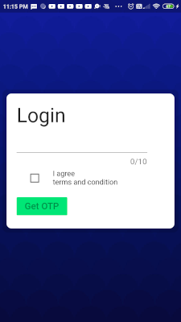
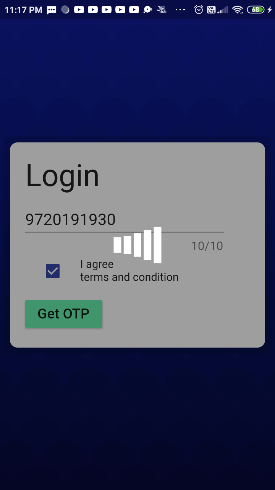
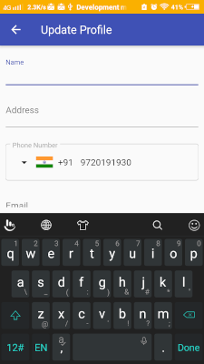
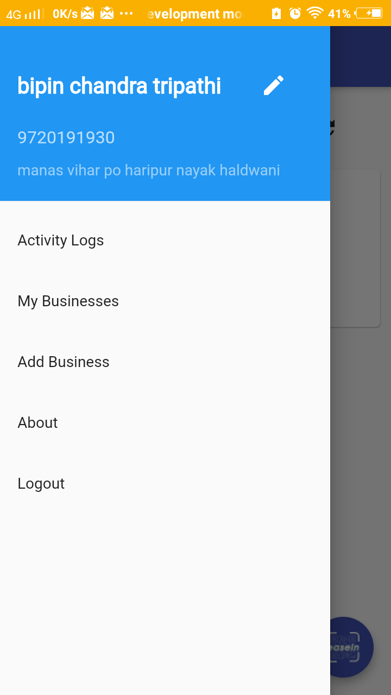
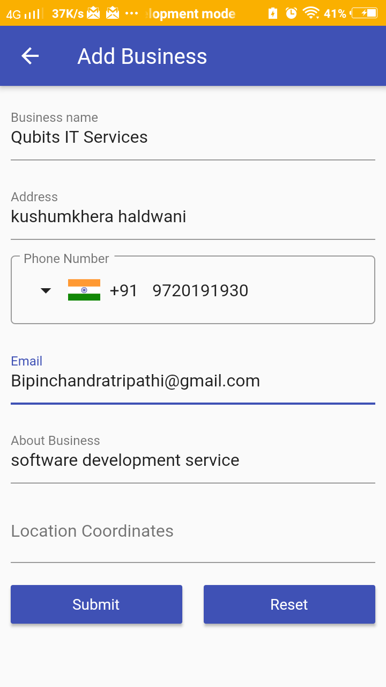
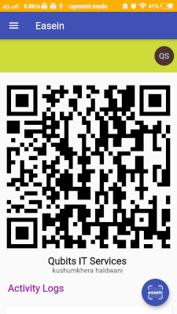
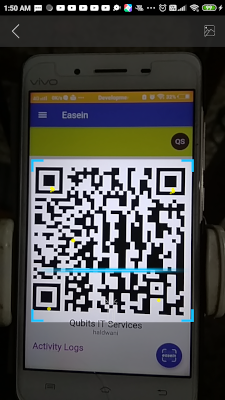
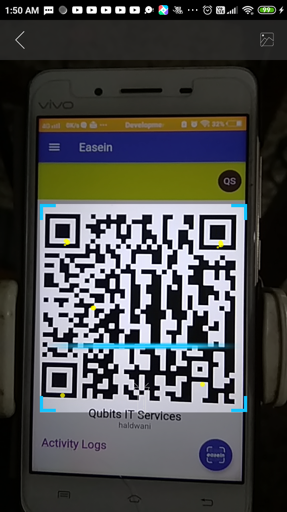

# Easein

A simple android assitance app for businesses to maintain people / customer visit logs during covid-19 pandemic situation.
It's a simple scan and go app, where user have to scan the QR code at businesses/store and their records are logged in both users and shop owners accounts and these records are also shared in form of google sheet with the  user and business verified emails. 

## Screens

| 
 
 
 
 
 
 
 
 

## Motivation

On 4th July 2020 Uttarkhand goverment announced that every business must have to keep records of every customer visit at their shops / businesses . 

This inspired us to develop an app to for business to assist them in hassle free record keeping.

## Support development
This app is available on playstore at free of cost .You can support us by donating at upi address: 9720191930@upi

## Live App

## Credits

 

[Puneet Yadav](https://twitter.com/puneetyadavv) 

### An Initiative to support Digtial India Movement

 

## License

[MIT](https://choosealicense.com/licenses/mit/)

